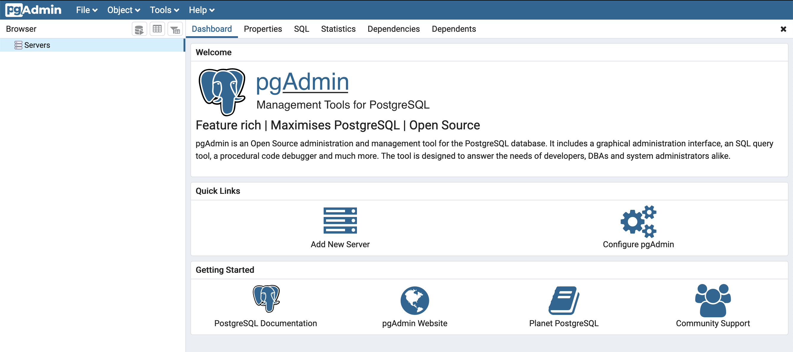
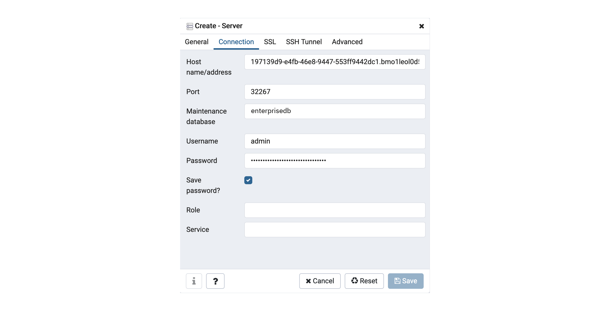
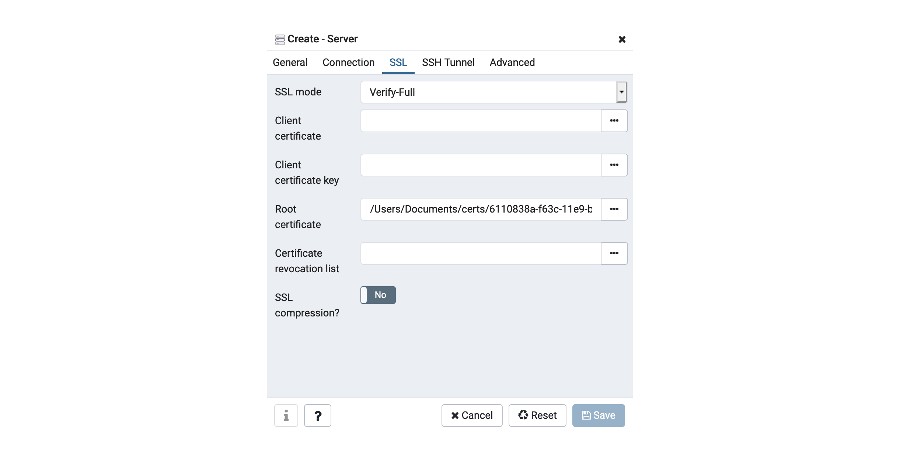
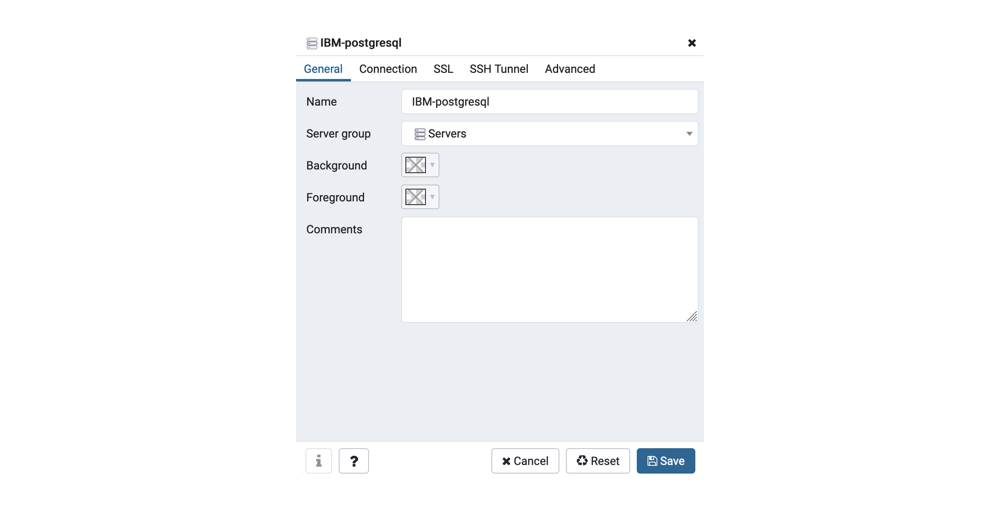
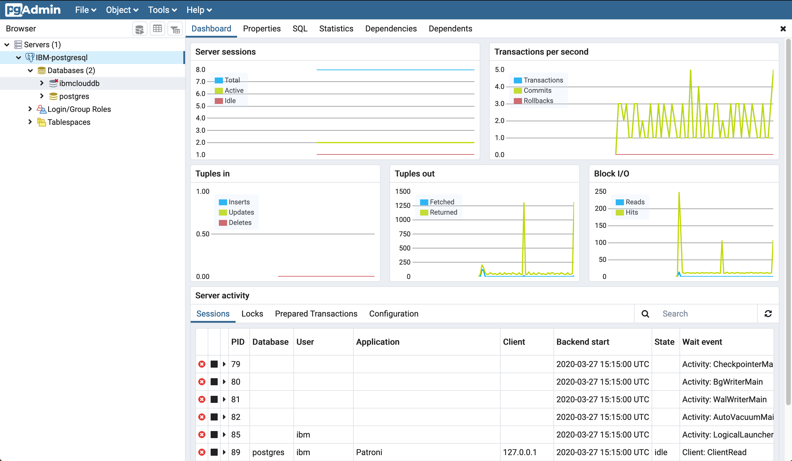

---

copyright:
  years: 2018, 2020
lastupdated: "2020-06-30"

keywords: pgAdmin, postgresql gui, edb, enterprisedb

subcollection: databases-for-enterprisedb

---

{:shortdesc: .shortdesc}
{:new_window: target="_blank"}
{:codeblock: .codeblock}
{:pre: .pre}
{:screen: .screen}
{:tip: .tip}

# Getting Started
{: #getting-started}

This tutorial is a short introduction to using an {{site.data.keyword.databases-for-enterprisedb_full}} deployment. [pgAdmin](https://www.pgadmin.org/) is an open source administration platform for PostgreSQL, and provides many tools for managing your data and databases. [Download and install](https://www.pgadmin.org/download/) the version that is appropriate to your environment, and then follow the steps to connect it to your {{site.data.keyword.databases-for-enterprisedb}} deployment.

## Before you begin

- You need to have an [{{site.data.keyword.cloud_notm}} account](https://cloud.ibm.com/registration){:new_window}.
- And a {{site.data.keyword.databases-for-enterprisedb}} deployment. You can provision one from the [{{site.data.keyword.cloud_notm}} catalog](https://cloud.ibm.com/catalog/services/databases-for-enterprisedb). Give your deployment a memorable name that appears in your account's Resource List.
- [Set the Admin Password](/docs/databases-for-enterprisedb?topic=databases-for-enterprisedb-admin-password) for your deployment.
- An installation of [pgAdmin4](https://www.pgadmin.org/download/).

## Connecting with pgAdmin

pgAdmin runs as a server and you connect to it through a browser. When the server is started, it runs on localhost, at default `http://127.0.0.1:53113/browser/`.

When you first open pgAdmin, you get a prompt for setting a Primary Password. This password is different from your deployment's password; it is used specifically for pgAdmin to store passwords to your {{site.data.keyword.databases-for-enterprisedb}} servers or deployments.

The _Dashboard_ pane has a _Welcome_ screen. From the _Quick Links_, click _Add New Server_.

On your deployment's _Manage_ page, there is a pane with all the relevant connection information.

Back in pgAdmin, provide pgAdmin with the information it needs to connect to your deployment. 

First, complete the _Connection_ information, 
- For _Host name/address_, use the _Hostname_ of your deployment.
- For the _Port_, use the _Port_ of your deployment.
- The _Maintenance database_ remains `postgres`.
- For _Username_ and _Password_, use the `admin` credentials that you set after provisioning your deployment. You can choose to have pgAdmin save the password.
- The _Role_ and _Service_ fields can be left empty.

Then, configure the _SSL_ settings.
- Copy the certificate information from the _Endpoints_ pane.
- Save the certificate to a file. (You can use the name that is provided in the download, or your own file name.)
- Set the _SSL mode_ field to _Verify-Full_.
- In the _Root certificate_ field, select the file where you saved your deployment's certificate.

Back on the _General_ tab, give your deployment a name and add any comments that you want to describe or identify your deployment in pgAdmin.

If the _Connect now?_ field is checked, pgAdmin attempts to connect to your deployment when you click the **Save** button.

## Using pgAdmin

Once pgAdmin connects, your deployment appears in the _Servers_ list and you get a _Dashboard_ with information and statistics. 

In the list of databases in the _Browser_, you see both the `postgres` database, which you are connected to, and the `ibmclouddb` database, which is the default database for all {{site.data.keyword.databases-for-enterprisedb}} deployments. Click `ibmclouddb` to connect to it and expand the information about it.

Now you can use pgAdmin to view, administer, and manage your data and databases in your {{site.data.keyword.databases-for-enterprisedb}} deployment. A complete guide can be found in the [pgAdmin documentation](https://www.pgadmin.org/docs/pgadmin4/latest/index.html).

Administrative features that require a superuser are not available through pgAdmin because superuser access is not available to users of a {{site.data.keyword.databases-for-enterprisedb}} deployment.
{: .tip}

## Next Steps

If you are just using PostgreSQL for the first time, it is a good idea to take a tour through the [official PostgreSQL documentation](https://www.postgresql.org/docs/). 

You can connect to and manage your databases and data with PostgreSQL's command-line tool [`psql`](/docs/databases-for-enterprisedb?topic=databases-for-enterprisedb-connecting-psql).

Looking for more tools on managing your deployment? You can connect to your deployment with [IBM Cloud CLI](/docs/cli?topic=cli-install-ibmcloud-cli) and the [Cloud Databases CLI plug-in](/docs/databases-cli-plugin?topic=databases-cli-plugin-cdb-reference). Or use the [Cloud Databases API](https://cloud.ibm.com/apidocs/cloud-databases-api).

If you are planning to use {{site.data.keyword.databases-for-enterprisedb}} for your applications, check out some of our other documentation pages.
- [Connecting an external application](/docs/databases-for-enterprisedb?topic=databases-for-enterprisedb-external-app)
- [Connecting an IBM Cloud application](/docs/databases-for-enterprisedb?topic=databases-for-enterprisedb-ibmcloud-app)

Also, to ensure the stability of your applications and your database, check out the pages on 
- [High-Availability](/docs/databases-for-enterprisedb?topic=databases-for-enterprisedb-high-availability)
- [Performance](/docs/databases-for-enterprisedb?topic=databases-for-enterprisedb-performance)

