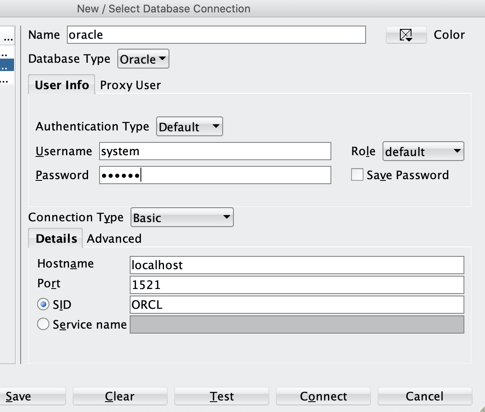
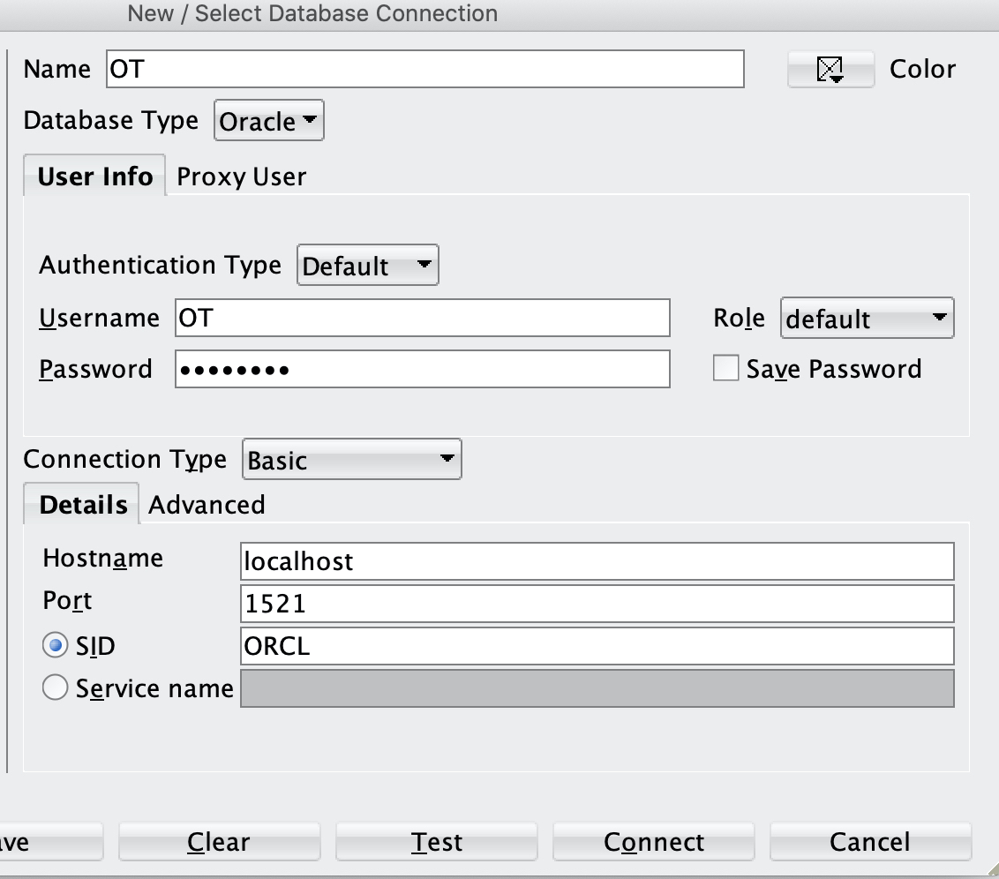

---
copyright:
  years: 2019, 2020
lastupdated: "2020-06-22"

keywords: postgresql, databases, oracle

subcollection: databases-for-enterprisedb

---

{:new_window: target="_blank"}
{:shortdesc: .shortdesc}
{:screen: .screen}
{:codeblock: .codeblock}
{:pre: .pre}
{:tip: .tip}

# Oracle to EnterpriseDB Migration
{: #oracle-migrating}

This document contains details about how to setup and execute and migration from a local Oracle database
to {{site.data.keyword.databases-for-enterprisedb_full}} formation using EnterpriseDB Migration portal (EMP) and EnterpriseDB Migration toolkit (MTK)


## Prerequisites

- Create an Enterprisedb account [here](https://www.enterprisedb.com/) 
- Request Enterprisedb repo access: [here](https://info.enterprisedb.com/rs/069-ALB-339/images/Repository%20Access%2004-09-2019.pdf?_ga=2.254315016.140796928.1589217151-186337169.1584631506)
- Ceate an Oracle account: [here](https://www.oracle.com/index.html)
- Docker


### {{site.data.keyword.databases-for-enterprisedb}} setup:

1. Target a dev cluster on ICD
    ```text
        icdctl cl $CLUSTER_ID    
    ```
2. Provision a new {{site.data.keyword.databases-for-enterprisedb}} formation
    ```text
       icdctl ns $YOUR_NAMESPACE
       icdctl provision enterprisedb edb-migration    
    ```
3. Migrating from Oracle to {{site.data.keyword.databases-for-enterprisedb}} using MTK requires using superuser. To create a superuser on edb formation
    1. Target the created edb formatioon 
    ```text
       icdctl f edb-migration
    ```
    1. Check the cluster status to figure out which pod is the leader 
    ```text
       icdctl edbcs
    ```
    1. Get a shell to the leader pod 
     ```text
        icdctl console -c mgmt $LEADER_POD
     ```
    2. Login to the database as a superuser
    ```text
        psql -d ibmclouddb
    ```
    1. Create migration superuser by running this query 
    ```text
        CREATE ROLE enterprisedb LOGIN SUPERUSER PASSWORD 'password';
    ```

### Local Oracle DB Setup:

1. Get the publicly available `oracle-12c-ee docker` image [here](https://hub.docker.com/r/absolutapps/oracle-12c-ee)
    ```text
       docker pull absolutapps/oracle-12c-ee
    ```
2. Create a local folder for mounting the database data folder, for example,
    ```text
       mkdir ~/oracle-12c-ee
    ``` 
3. Start oracle container and wait for it to finish setup
    ```text
       docker run -d --name oracle --privileged -v ~/oracle-12c-ee:/u01/app/oracle -p 8080:8080 -p 1521:1521 absolutapps/oracle-12c-ee
    ```
4. Tail the initialization process
   ```text
        docker logs -f --tail all oracle
   ```
5. The oracle database will be created with the following defaults
    ```text
    Defaults:
		username: system
		password: oracle
		SID: ORCL
    ```

#### Install SQL developer for easier interaction with the database:
1. Download SQL Developer [here](https://www.oracle.com/tools/downloads/sqldev-v192-downloads.html)
2. Setup a new connection `oracle`


#### Create OT schema and load data:
1. Download the OT oracle schema from [here](https://www.oracletutorial.com/getting-started/oracle-sample-database/)
2. Using `oracle` connection we created above open a work sheet and copy paste the content of `ot_create_user.sql`and add to it
the following then click on `run script`. 
```text
	-- grant more priviledges
	GRANT SELECT_CATALOG_ROLE TO OT;
	GRANT create session TO OT;
	GRANT create table TO OT;
	GRANT create synonym TO OT;
	GRANT create any procedure TO OT1;
	GRANT create sequence TO OT1;
	ALTER USER OT quota unlimited on USERS;
``` 
Note: `ot_create_user.sql` has OT password set to `yourpassword`, this guide will assume that is changed to `password`
1. Create a new connection in SQL Developer for OT schema as the following and connect to it 

2. Create the OT oracle schema by coying and pasting the content of `ot_schema.sql` to  SQL Developer worksheet and click on `run script`
3. Load data to the created schema by copying and pasting the content of `ot_data.sql` to  SQL Developer worksheet and click on `run script`


### Extract the oracle schema using Enterisedb DDL Extractor:
1. Login to edb migration portal [here](https://migration.enterprisedb.com/)
2. Click on `Portal Wiki`
3. Follow the steps in `DDL Extractor guide` section
4. On successful attempt a file like `_gen_ot_ddls_200511173723.sql` will be created in the specified path

### Validate the extracted schema with migration portal:
1. Login to edb migration portal [here](https://migration.enterprisedb.com/)
2. Create a new project and load DDL Extractor generated file for assessment 

3. You will face Errors with Constraints assessment, like the following, and to fix that you need to change foreign key converted type from `Number` to `BIGINT or SMALLINT`
	```text
		foreign key constraint "fk_countries_regions" cannot be implemented Detail: Key columns "region_id" and "region_id" are of incompatible types: numeric and bigint.
    ```
4. Fix all the constraints and make sure your are getting 100% coverage successfully

### Export converted schema from migration portal to EnterpriseDB formation:
1. Target the created {{site.data.keyword.databases-for-enterprisedb}} formation and get the connection info 
    ```text
       icdctl f edb-migration
    ``` 
    for example:
    ```text
       Connections:
           postgres://edb-migration.9e905d830c72461aba945f7788bbee87.databases.appdomain.cloud:32338
    ```
2. Export and deploy the converted schema from migration portal to your provisioned {{site.data.keyword.databases-for-enterprisedb}} formation 


### Verify schema migration to EnterpriseDB formation:
1. Get to the `mgmt` container 
    ```text
       icdctl console -c mgmt m-0
    ```
2. list the available databases
    ```text
    bash-4.2# psql -d ibmclouddb -c "\l"
                                             List of databases
         Name     |        Owner        | Encoding |  Collate   |   Ctype    | ICU | Access privileges
    --------------+---------------------+----------+------------+------------+-----+-------------------
     edb          | ibm                 | UTF8     | en_US.utf8 | en_US.utf8 |     |
     ibmclouddb   | ibm-cloud-base-user | UTF8     | en_US.utf8 | en_US.utf8 |     |
     ot_migration | enterprisedb        | UTF8     | en_US.utf8 | en_US.utf8 |     |
     postgres     | ibm                 | UTF8     | en_US.utf8 | en_US.utf8 |     |
     template0    | ibm                 | UTF8     | en_US.utf8 | en_US.utf8 |     | =c/ibm           +
                  |                     |          |            |            |     | ibm=CTc/ibm
     template1    | ibm                 | UTF8     | en_US.utf8 | en_US.utf8 |     | =c/ibm           +
                  |                     |          |            |            |     | ibm=CTc/ibm
    (6 rows)
    ``` 


### Install EnterpriseDB Migration toolkit into the oracle container:
1. Get a shell to the running oracle container 
	```text
	docker exec -it oracle /bin/bash
	```
2. Update yum repo 
	```text
	yum update
	```
3. Install Java 8 
	```text
	yum install java-1.8.0-openjdk-devel
	```
4. Follow the steps below on how to install Enterprisedb migration toolkit (skip IDENT Authentication section)
    [here](https://www.enterprisedb.com/edb-docs/d/edb-postgres-migration-toolkit/user-guides/user-guide/53.0.0/installing_mtk.html#using-an-rpm-package-to-install-migration-toolkit)
5. Migration toolkit script will be located in oracle container at: `/usr/edb/migrationtoolkit/bin/runMTK.sh`


### Migration toolkit setup:
MTK comes by default with edb jdbc driver, but to connect to oracle instance it needs you to install oracle jdbc
1. Download `ojdbc-full.tar.gz` from [here](https://www.oracle.com/database/technologies/jdbc-upc-downloads.html)
2. Move `ojdbc-full.tar.gz` to the mounted folder on your machine and unzip it
    ```text
        cp ~/Downloads/ojdbc-full.tar.gz ~/oracle-12c-ee/
        tar -xzf ojdbc-full.tar.gz
    ``` 
3. From the oracle container cd to the output folder of the tar command
    ```text
        cd /u01/app/oracle/OJDBC-Full
    ```
4. Copy `ojdbc7.jar` and `ucp.jar` and place them in the lib directory for the MTK tool
    ```text
		cp ojdbc7.jar /usr/edb/migrationtoolkit/lib
		cp ucp.jar /usr/edb/migrationtoolkit/lib 
    ```

### Execute MTK to migrate data from oracle to edb-migration formation:
1. Edit `toolkit.properties` file to setup source and target connections. The file is available at `/usr/edb/migrationtoolkit/etc/toolkit.properties`. [more about toolkit.properties](https://www.enterprisedb.com/edb-docs/d/edb-postgres-migration-toolkit/user-guides/user-guide/53.0.0/building_toolkit.properties_file.html)
Note: TARGET_HOST and TARGET_PORT can be retrieved from running `icdctl formation edb-migration`
    ```text
        Connections:
        	postgres://edb-migration.9e905d830c72461aba945f7788bbee87.databases.appdomain.cloud:32338
    ```
    In the above case, TARGET_HOST:TARGET_PORT = edb-migration.9e905d830c72461aba945f7788bbee87.databases.appdomain.cloud:32338

2. Following our setup in this guide, this is how the file should look like:
    ```text
        SRC_DB_URL=jdbc:oracle:thin:@localhost:1521:ORCL
        SRC_DB_USER=ot
        SRC_DB_PASSWORD=password

        TARGET_DB_URL=jdbc:edb://$TARGET_HOST:TARGET_PORT/ot_migration
        TARGET_DB_USER=enterprisedb
        TARGET_DB_PASSWORD=password
	```
3. Envoke MTK to start the data migration process from `OT` oracle schema to `ot` enterprisedb schema under `ot_migration` database. [for more about MTK args](https://www.enterprisedb.com/edb-docs/d/edb-postgres-migration-toolkit/user-guides/user-guide/53.0.0/mtk_command_options.html)

    ```text
        /usr/edb/migrationtoolkit/bin/runMTK.sh -dataOnly -targetSchema ot -truncLoad OT
    ```
4. A successful migration output sample
    ```text
        Enabling FK constraints & triggers on ot.warehouses...
        Enabling indexes on ot.warehouses after data load...
        Data Load Summary: Total Time (sec): 8.764 Total Rows: 2981 Total Size(MB): 0.105
        
        Schema OT imported successfully.
        
        
        Migration process completed successfully.
        
        Migration logs have been saved to /root/.enterprisedb/migration-toolkit/logs
        
        ******************** Migration Summary ********************
        Tables: 12 out of 12
        
        Total objects: 12
        Successful count: 12
        Failed count: 0
        Invalid count: 0
        
        *************************************************************
    ```

### Verify data migration on edb-migration formation:
1. Get to `mgmt` container 
    ```text
       icdct console -c mgmt m-0 
    ```
2. Query tables under `ot` schema
    ```text
        bash-4.2# psql -d ot_migration -c "select count(*) from ot.customers;"
         count
        -------
           319
        (1 row)
    ```
    