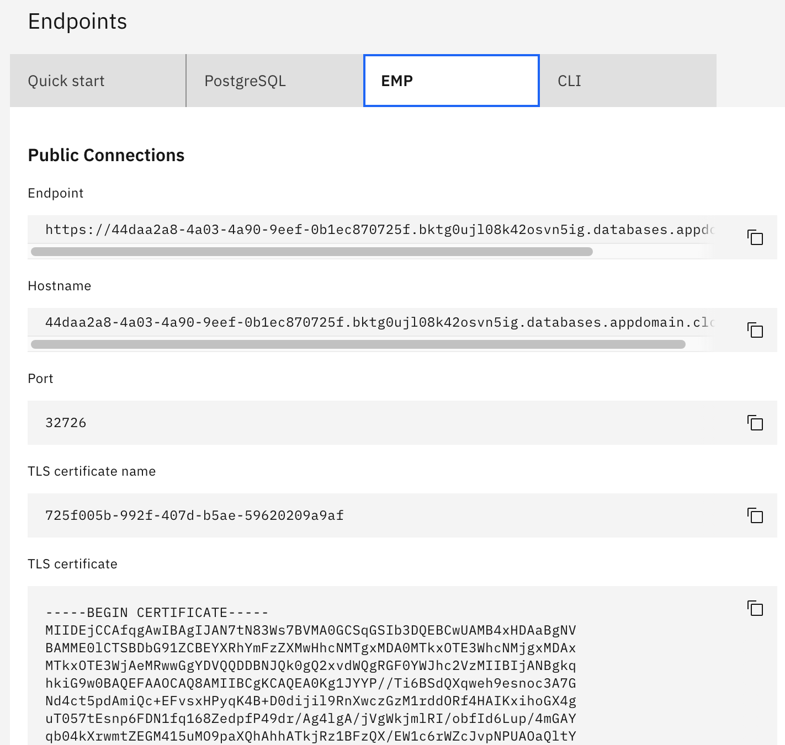
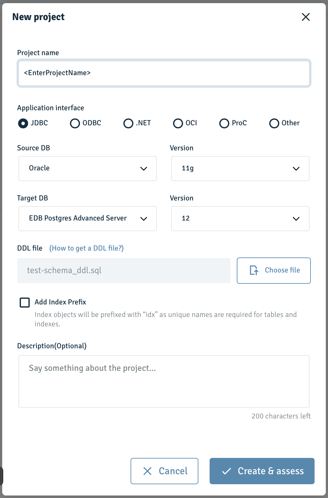
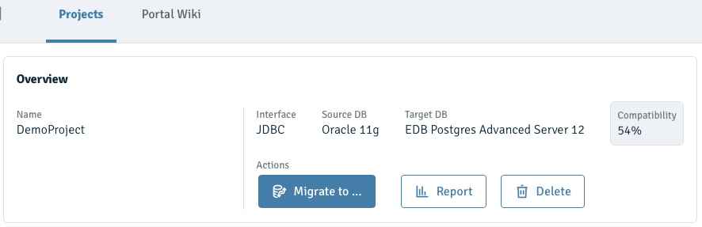
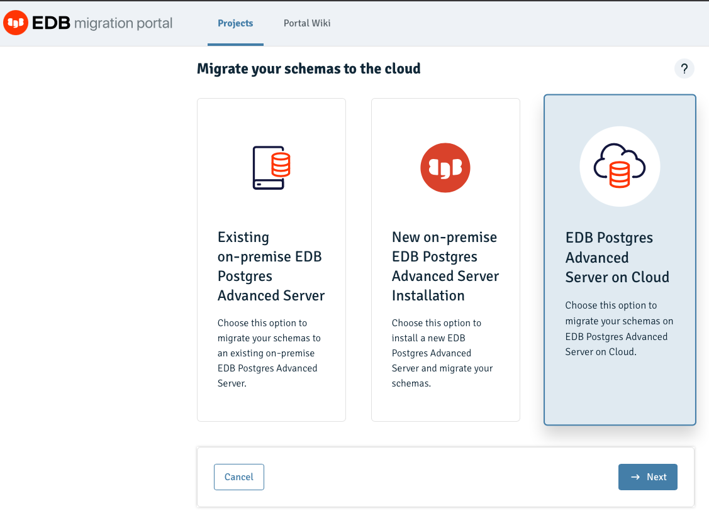
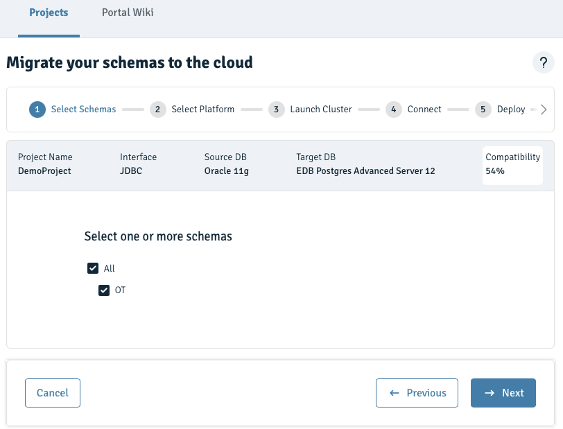
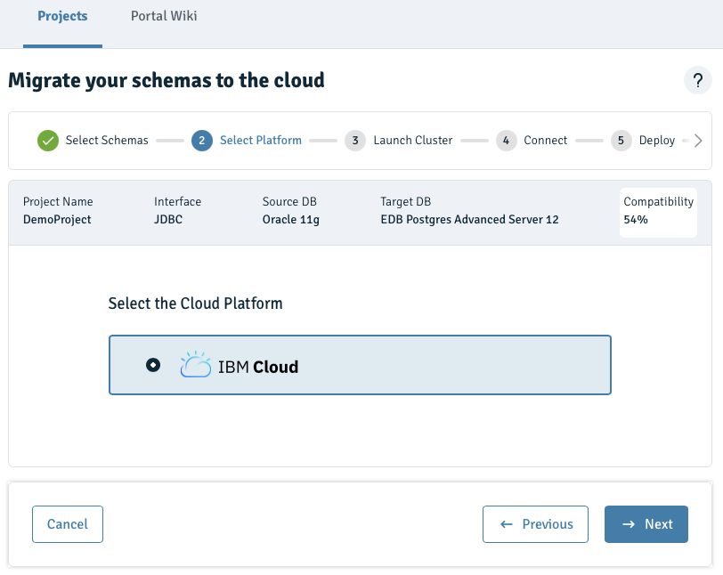
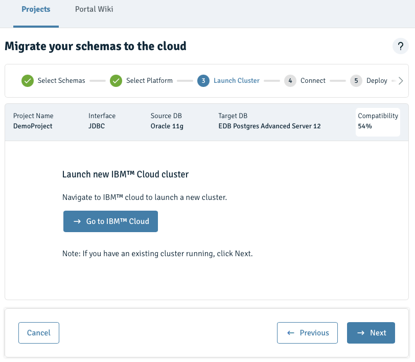
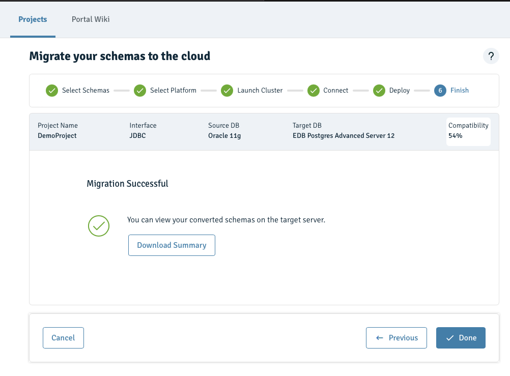

---
copyright:
  years: 2019, 2024
lastupdated: "2024-09-30"

keywords: postgresql, databases, EMP, edb, oracle, enterprisedb

subcollection: databases-for-enterprisedb

---

{{site.data.keyword.attribute-definition-list}}

# {{site.data.keyword.databases-for-enterprisedb}} Migration by using EMP
{: #oracle-migrating}

Details how to set up and run a migration from a local Oracle database to an {{site.data.keyword.databases-for-enterprisedb_full}} formation by using the {{site.data.keyword.databases-for}} EnterpriseDB Migration Portal (EMP). 

## Prerequisites and notes
{: #prereqs-notes}

### Prerequisites 
{: #prereqs}

- You need an [{{site.data.keyword.cloud_notm}} account](https://cloud.ibm.com/registration){: .external}
- You also need an {{site.data.keyword.databases-for-enterprisedb}} deployment. Provision from the [{{site.data.keyword.cloud_notm}} catalog](https://cloud.ibm.com/catalog/services/databases-for-enterprisedb). Give your deployment a memorable name that appears in your account's Resource List.

### Notes
{: #notes}

- The {{site.data.keyword.databases-for-enterprisedb}} Migration Portal (EMP) is only for schema assessment and migration.
- EMP projects are only visible to the user that created the project. Individual users each have their own set of projects in the EMP that are visible only to themselves.
- While EMP is available on public or private endpoints, it can exist only on one endpoint for the same formation. For example, if you provisioned {{site.data.keyword.databases-for-enterprisedb}} with only public enabled, then EMP exists on a public endpoint. Likewise, if you provisioned {{site.data.keyword.databases-for-enterprisedb}} with only private enabled then EMP exists only on a private endpoint. However, if you provisioned {{site.data.keyword.databases-for-enterprisedb}} on _both public and private_ at the same time, then EMP is available _only on the public endpoint_.

 
## Accessing the EnterpriseDB Migration portal (EMP)
{: #accessing-emp}

- EMP is provisioned along with your {{site.data.keyword.databases-for-enterprisedb}} deployment. 
- EMP access is provided in the EMP tab in the `Endpoints` section of the overview tab in the {{site.data.keyword.databases-for-enterprisedb}} dashboard. 

    {: caption="EMP Endpoint" caption-side="bottom"}

   1. Copy the Endpoint URL into a new browser window to start the EMP. 
   2. In the resulting window, log in using your {{site.data.keyword.cloud_notm}} account credentials.
         
  
## {{site.data.keyword.databases-for-enterprisedb}} schema migration by using EMP
{: #emp-migrating}

### Extract the schema 
{: #extract-schema}

1. Log in to the EnterpriseDB migration portal (EMP).
2. Click `Portal Wiki`
3. Follow the steps in `DDL Extractor guide` section
4. After a successful attempt, a file like `_gen_ot_ddls_2005111737123.sql` is created in the specified path

### Validate the extracted schema 
{: #validate-schema}

1. Log in to the EnterpriseDB migration portal (EMP)
2. Create a project by clicking `New`. 
3. Enter a project name, and load the DDL Extractor-generated file for assessment. EMP accepts only single string project names without spaces.
    
    {: caption="migration-portal-setup" caption-side="bottom"}

4. Click `Create & Assess`.
5. Fix any issue report by the EMP and make sure you are getting 100% coverage successfully

### Migrate your exported converted schema into your EnterpriseDB formation
{: #migrate-schema}

Export and deploy the converted schema from migration portal to your provisioned {{site.data.keyword.databases-for-enterprisedb}} formation.

1. Select the `Migrate to...` button to begin the migration process.

    {: caption="Begin migration" caption-side="bottom"}

1. Choose the `EDB Postgres Advanced Server on Cloud` option to migrate your schemas on EDB Postgres Advanced Server on Cloud, and click "next". 

    {: caption="Select Cloud destination" caption-side="bottom"}

1. Select the schemas and click "next".

    {: caption="Select schemas" caption-side="bottom"}

1. Select the schemas and click "next".

    {: caption="Select platform" caption-side="bottom"}

1. Click next to use an existing cluster (or click `Go to IBM Cloud` to create a new cluster).

    {: caption="Create or use existing cluster" caption-side="bottom"}

1. Connect to an existing cluster. Enter the target deployment's details (hostname and port are available on the deployment's endpoints PostgresSQL tab) and click `Test Connection` to validate the connection. To deploy, click "next" after a successful connection is confirmed. 

   {: caption="Connection details for an existing cluster" caption-side="bottom"}
   You can use the admin user (after changing its password), or you can create a new db user on the database and use those credentials.{: .tip}

1. Upon successful migration completion, download and review the summary log file, and click "done" to exit from the process. 

    {: caption="Connection details for an existing cluster" caption-side="bottom"}


### Verify schema migration to EnterpriseDB formation
{: #verify-schema-migration}

List the available databases by using the CLI command: `psql -d ibmclouddb -c "\l"`
```sh
bash-4.2# psql -d ibmclouddb -c "\l"
                                         List of databases
     Name     |        Owner        | Encoding |  Collate   |   Ctype    | ICU | Access privileges
--------------+---------------------+----------+------------+------------+-----+-------------------
 edb          | ibm                 | UTF8     | en_US.utf8 | en_US.utf8 |     |
 ibmclouddb   | ibm-cloud-base-user | UTF8     | en_US.utf8 | en_US.utf8 |     |
 ot_migration | enterprisedb        | UTF8     | en_US.utf8 | en_US.utf8 |     |
 postgres     | ibm                 | UTF8     | en_US.utf8 | en_US.utf8 |     |
 template0    | ibm                 | UTF8     | en_US.utf8 | en_US.utf8 |     | =c/ibm           +
              |                     |          |            |            |     | ibm=CTc/ibm
 template1    | ibm                 | UTF8     | en_US.utf8 | en_US.utf8 |     | =c/ibm           +
              |                     |          |            |            |     | ibm=CTc/ibm
(6 rows)
``` 

## Data migration by using the EnterpriseDB Migration Toolkit (MTK)
{: #data-mtk}

MTK is managed by an external party, [EDB](https://www.enterprisedb.com/){: .external}. Use of this toolkit is at your own risk and subject to the EDB terms and conditions. For more details, review the [IBM Open Source and Third-party software policy](https://www.ibm.com/support/pages/ibm-open-source-and-third-party-software-policy). 
{: .note}

### Install EnterpriseDB Migration Toolkit
{: #install-migration-toolkit}

1. Follow the steps on how to install the EnterpriseDB Migration Toolkit [here](https://www.enterprisedb.com/edb-docs/d/edb-postgres-migration-toolkit/user-guides/user-guide/53.0.2/installing_mtk.html#using-an-rpm-package-to-install-migration-toolkit). (Skip the IDENT Authentication section in the installation guide.)
1. Migration Toolkit script is located in the Oracle container at: `/usr/edb/migrationtoolkit/bin/runMTK.sh`
   MTK by default includes the `edb jdbc driver`, but to connect to an Oracle instance you must install the Oracle jdbc.{: .note}


### Run MTK to migrate data from Oracle to edb-migration formation
{: #run-mtk}

1. Edit `toolkit.properties` file to set up source and target connections. The file is available at `/usr/edb/migrationtoolkit/etc/toolkit.properties`. [More about toolkit.properties](https://www.enterprisedb.com/edb-docs/d/edb-postgres-migration-toolkit/user-guides/user-guide/53.0.2/building_toolkit.properties_file.html)
1. Following the setup steps, the `toolkit.properties` file now resembles:
    ```text
        SRC_DB_URL=jdbc:oracle:thin:@localhost:1521:ORCL
        SRC_DB_USER=ot
        SRC_DB_PASSWORD=password

        TARGET_DB_URL=jdbc:edb://$TARGET_HOST:TARGET_PORT/ot_migration
        TARGET_DB_USER=enterprisedb
        TARGET_DB_PASSWORD=password
	```
1. Start MTK to begin the data migration process from `OT` Oracle schema to `ot` EnterpriseDB schema under `ot_migration` database. For more about MTK args, see [Migration Tookit](https://www.enterprisedb.com/edb-docs/d/edb-postgres-migration-toolkit/user-guides/user-guide/53.0.2/mtk_command_options.html){: .external}

    ```sh
        /usr/edb/migrationtoolkit/bin/runMTK.sh -dataOnly -targetSchema ot -truncLoad OT
    ```
1. A successful migration output sample:
    ```sh
        Enabling FK constraints & triggers on ot.warehouses...
        Enabling indexes on ot.warehouses after data load...
        Data Load Summary: Total Time (sec): 8.764 Total Rows: 2981 Total Size(MB): 0.105
        
        Schema OT imported successfully.
        
        Migration process completed successfully.
        
        Migration logs have been saved to /root/.enterprisedb/migration-toolkit/logs
        
        ******************** Migration Summary ********************
        Tables: 12 out of 12
        
        Total objects: 12
        Successful count: 12
        Failed count: 0
        Invalid count: 0
        
        *************************************************************
    ```


## Oracle to {{site.data.keyword.databases-for-enterprisedb}} Migration by using MTK only
{: #oracle-migration}

You can run schema extraction, schema migration, and data migration by using Migration Toolkit (MTK) only. To do that you need to:

1. Install and setup MTK locally following the steps noted under the heading: [`Install EnterpriseDB Migration toolkit`](###install-enterprisedb-migrationtoolkit)
1. Follow the MTK command options for `Import Options` and `Schema Creation` to extract and migrate Oracle schema and data [here](https://www.enterprisedb.com/edb-docs/d/edb-postgres-migration-toolkit/user-guides/user-guide/53.0.2/mtk_command_options.html)
1. MTK also supports offline migration for both schema and data [here](https://www.enterprisedb.com/edb-docs/d/edb-postgres-migration-toolkit/user-guides/user-guide/53.0.2/mtk_command_options.html#offline-migration-options)
