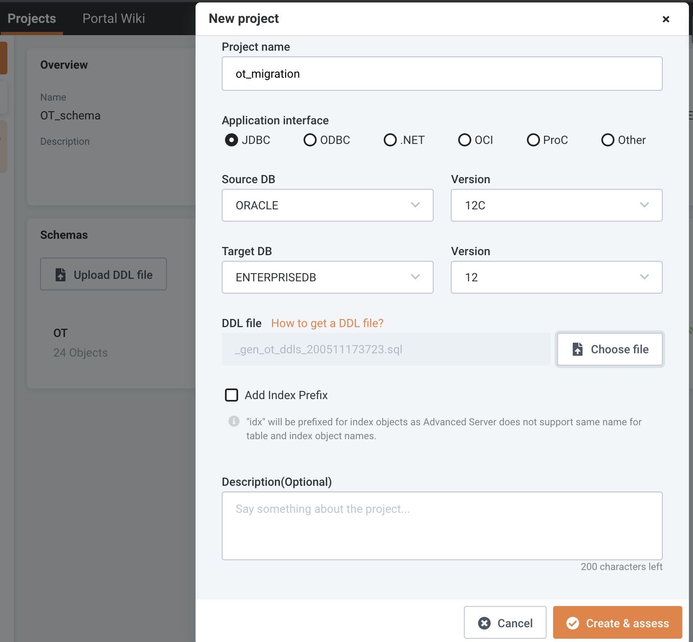
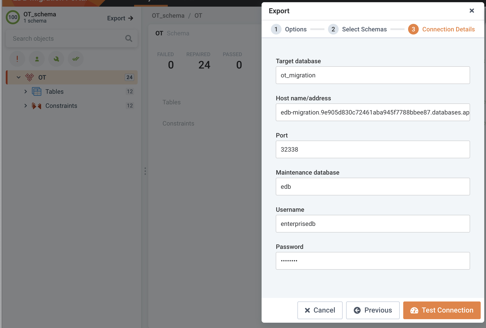

---
copyright:
  years: 2019, 2020
lastupdated: "2020-06-25"

keywords: postgresql, databases, oracle

subcollection: databases-for-enterprisedb

---

{:new_window: target="_blank"}
{:shortdesc: .shortdesc}
{:screen: .screen}
{:codeblock: .codeblock}
{:pre: .pre}
{:tip: .tip}

# Oracle to {{site.data.keyword.databases-for-enterprisedb}} Migration
{: #oracle-migrating}

Details how to set up and run a migration from a local Oracle Database to an {{site.data.keyword.databases-for-enterprisedb_full}} formation by using the EnterpriseDB Migration Toolkit (MTK) with and without the EnterpriseDB Migration portal (EMP). 


## Prerequisites

- Create an EnterpriseDB account [here](https://www.enterprisedb.com/) 
- Request EnterpriseDB repo access [here](https://info.enterprisedb.com/rs/069-ALB-339/images/Repository%20Access%2004-09-2019.pdf?_ga=2.254315016.140796928.1589217151-186337169.1584631506)
- Provision an {{site.data.keyword.databases-for-enterprisedb_full}}

## Oracle to {{site.data.keyword.databases-for-enterprisedb}} Migration by using MTK only
You can run schema extraction, schema migration and Data migration by using MTK only. To do that you need to:
1. Install and setup MTK locally following the steps noted under the heading: [`Install EnterpriseDB Migration toolkit (MTK)`](###install-enterprisedb-migrationtoolkit-mtk)
2. Follow the MTK command options for `Import Options` and `Schema Creation` to extract and migrate Oracle schema and data [here](https://www.enterprisedb.com/edb-docs/d/edb-postgres-migration-toolkit/user-guides/user-guide/52.0.3/mtk_command_options.html)
3. MTK also supports offline migration for both schema and data [here](https://www.enterprisedb.com/edb-docs/d/edb-postgres-migration-toolkit/user-guides/user-guide/52.0.3/mtk_command_options.html#offline-migration-options)

## Oracle to {{site.data.keyword.databases-for-enterprisedb}} Migration by using EMP and MTK

### Extract the Oracle schema by using the Enterisedb DDL Extractor
1. Log in to the EnterpriseDB migration portal [here](https://migration.enterprisedb.com/)
2. Click `Portal Wiki`
3. Follow the steps in `DDL Extractor guide` section
4. After a successful attempt, a file like `_gen_ot_ddls_200511173723.sql` is created in the specified path

### Validate the extracted schema with migration portal
1. Log in to the EnterpriseDB migration portal [here](https://migration.enterprisedb.com/)
2. Create a new project and load the DDL Extractor-generated file for assessment 

3. Fix any issue report by the EMP and make sure your are getting 100% coverage successfully

### Export converted schema from migration portal to EnterpriseDB formation
1. Export and deploy the converted schema from migration portal to your provisioned {{site.data.keyword.databases-for-enterprisedb}} formation 



### Verify schema migration to EnterpriseDB formation
1. List the available databases
    ```text
    bash-4.2# psql -d ibmclouddb -c "\l"
                                             List of databases
         Name     |        Owner        | Encoding |  Collate   |   Ctype    | ICU | Access privileges
    --------------+---------------------+----------+------------+------------+-----+-------------------
     edb          | ibm                 | UTF8     | en_US.utf8 | en_US.utf8 |     |
     ibmclouddb   | ibm-cloud-base-user | UTF8     | en_US.utf8 | en_US.utf8 |     |
     ot_migration | enterprisedb        | UTF8     | en_US.utf8 | en_US.utf8 |     |
     postgres     | ibm                 | UTF8     | en_US.utf8 | en_US.utf8 |     |
     template0    | ibm                 | UTF8     | en_US.utf8 | en_US.utf8 |     | =c/ibm           +
                  |                     |          |            |            |     | ibm=CTc/ibm
     template1    | ibm                 | UTF8     | en_US.utf8 | en_US.utf8 |     | =c/ibm           +
                  |                     |          |            |            |     | ibm=CTc/ibm
    (6 rows)
    ``` 


### Install EnterpriseDB Migration Toolkit (MTK)
1. Follow the steps on how to install EnterpriseDB Migration Toolkit (skip IDENT Authentication section)
    [here](https://www.enterprisedb.com/edb-docs/d/edb-postgres-migration-toolkit/user-guides/user-guide/53.0.0/installing_mtk.html#using-an-rpm-package-to-install-migration-toolkit)
2. Migration Toolkit script is located in the Oracle container at: `/usr/edb/migrationtoolkit/bin/runMTK.sh`
   
Note: MTK by default includes the `edb jdbc driver`, but to connect to an Oracle instance you must install the Oracle jdbc

### Run MTK to migrate data from Oracle to edb-migration formation
1. Edit `toolkit.properties` file to set up source and target connections. The file is available at `/usr/edb/migrationtoolkit/etc/toolkit.properties`. [More about toolkit.properties](https://www.enterprisedb.com/edb-docs/d/edb-postgres-migration-toolkit/user-guides/user-guide/53.0.0/building_toolkit.properties_file.html)
2. Following these set-up steps, this is how the `toolkit.properties` file should appear:
    ```text
        SRC_DB_URL=jdbc:oracle:thin:@localhost:1521:ORCL
        SRC_DB_USER=ot
        SRC_DB_PASSWORD=password

        TARGET_DB_URL=jdbc:edb://$TARGET_HOST:TARGET_PORT/ot_migration
        TARGET_DB_USER=enterprisedb
        TARGET_DB_PASSWORD=password
	```
3. Launch MTK to start the data migration process from `OT` Oracle schema to `ot` EnterpriseDB schema under `ot_migration` database. [For more about MTK args](https://www.enterprisedb.com/edb-docs/d/edb-postgres-migration-toolkit/user-guides/user-guide/53.0.0/mtk_command_options.html)

    ```text
        /usr/edb/migrationtoolkit/bin/runMTK.sh -dataOnly -targetSchema ot -truncLoad OT
    ```
4. A successful migration output sample
    ```text
        Enabling FK constraints & triggers on ot.warehouses...
        Enabling indexes on ot.warehouses after data load...
        Data Load Summary: Total Time (sec): 8.764 Total Rows: 2981 Total Size(MB): 0.105
        
        Schema OT imported successfully.
        
        
        Migration process completed successfully.
        
        Migration logs have been saved to /root/.enterprisedb/migration-toolkit/logs
        
        ******************** Migration Summary ********************
        Tables: 12 out of 12
        
        Total objects: 12
        Successful count: 12
        Failed count: 0
        Invalid count: 0
        
        *************************************************************
    ```

