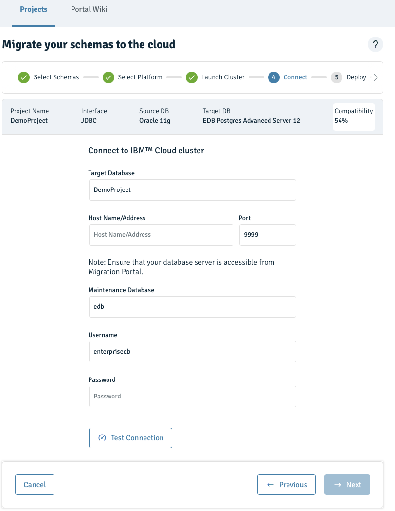

---
copyright:
  years: 2019, 2020
lastupdated: "2020-12-09"

keywords: postgresql, databases, EMP, edb, oracle, enterprisedb

subcollection: databases-for-enterprisedb

---

{:new_window: target="_blank"}
{:shortdesc: .shortdesc}
{:screen: .screen}
{:codeblock: .codeblock}
{:pre: .pre}
{:tip: .tip}

# {{site.data.keyword.databases-for-enterprisedb}} Migration by using EMP
{: #oracle-migrating}

Details how to set up and run a migration from a local Oracle database to an {{site.data.keyword.databases-for-enterprisedb_full}} formation by using the {{site.data.keyword.databases-for}} EnterpriseDB Migration Portal (EMP). 

## Prerequisites and notes
### Prerequisites 
- You need an [{{site.data.keyword.cloud_notm}} account](https://cloud.ibm.com/registration){: .new_window}
- And a {{site.data.keyword.databases-for-enterprisedb}} deployment. You can provision one from the [{{site.data.keyword.cloud_notm}} catalog](https://cloud.ibm.com/catalog/services/databases-for-enterprisedb). Give your deployment a memorable name that appears in your account's Resource List.
### Notes
- The {{site.data.keyword.databases-for-enterprisedb}} Migration Portal (EMP) is only for schema assessment and migration.
- EMP projects are only visible to the user that created the project. Individual users each have their own set of projects in the EMP that are visible only to themselves.
- While EMP is available on public or private endpoints, it can exist only on one endpoint for the same formation. For example, if you provisioned {{site.data.keyword.databases-for-enterprisedb}} with only public enabled, then EMP exists on a public endpoint. Likewise, if you provisioned {{site.data.keyword.databases-for-enterprisedb}} with only private enabled then EMP exists only on a private endpoint. However, if you provisioned {{site.data.keyword.databases-for-enterprisedb}} on _both public and private_ at the same time, then EMP is available _only on the public endpoint_.

 
## Accessing the EnterpriseDB Migration portal (EMP)
{: #accessing-emp}

- EMP is provisioned along with your {{site.data.keyword.databases-for-enterprisedb}} deployment. 
- EMP access is provided in the EMP tab in the `Endpoints` section of the overview tab in the {{site.data.keyword.databases-for-enterprisedb}} dashboard. 

    

  1. Copy the Endpoint URL into a new browser window to start the EMP. 
  2. In the resulting window, log in using your {{site.data.keyword.cloud_notm}} account credentials.
         
  
## {{site.data.keyword.databases-for-enterprisedb}} schema migration by using EMP
{: #emp-migrating}

### Extract the schema 
1. Log in to the EnterpriseDB migration portal (EMP).
2. Click `Portal Wiki`
3. Follow the steps in `DDL Extractor guide` section
4. After a successful attempt, a file like `_gen_ot_ddls_2005111737123.sql` is created in the specified path

### Validate the extracted schema 
1. Log in to the EnterpriseDB migration portal (EMP)
2. Create a project by clicking `New`. 
3. Enter a project name, and load the DDL Extractor-generated file for assessment. (Note: EMP accepts only single string project names without spaces.) 
    
    

4. Click `Create & Assess`.
5. Fix any issue report by the EMP and make sure you are getting 100% coverage successfully

### Migrate your exported converted schema into your EnterpriseDB formation
Export and deploy the converted schema from migration portal to your provisioned {{site.data.keyword.databases-for-enterprisedb}} formation.

1. Select the `Migrate to...` button to begin the migration process.

    

2. Choose the `EDB Postgres Advanced Server on Cloud` option to migrate your schemas on EDB Postgres Advanced Server on Cloud, and click "next". 

    

3. Select the schemas and click "next".

    

4. Select the schemas and click "next".

    

5. Click next to use an existing cluster (or click `Go to IBM Cloud` to create a new cluster).

    

6. Connect to an existing cluster. Enter the target deployment's details (hostname and port are available on the deployment's endpoints PostgresSQL tab) and click `Test Connection` to validate the connection. To deploy, click "next" after a successful connection is confirmed. 

    
You can use the admin user (after changing its password), or you can create a new db user on the database and use those credentials.
{: .tip}

6. Upon successful migration completion, download and review the summary log file, and click "done" to exit from the process. 

    


### Verify schema migration to EnterpriseDB formation
1. List the available databases by using the CLI command: `psql -d ibmclouddb -c "\l"`
    ```text
    bash-4.2# psql -d ibmclouddb -c "\l"
                                             List of databases
         Name     |        Owner        | Encoding |  Collate   |   Ctype    | ICU | Access privileges
    --------------+---------------------+----------+------------+------------+-----+-------------------
     edb          | ibm                 | UTF8     | en_US.utf8 | en_US.utf8 |     |
     ibmclouddb   | ibm-cloud-base-user | UTF8     | en_US.utf8 | en_US.utf8 |     |
     ot_migration | enterprisedb        | UTF8     | en_US.utf8 | en_US.utf8 |     |
     postgres     | ibm                 | UTF8     | en_US.utf8 | en_US.utf8 |     |
     template0    | ibm                 | UTF8     | en_US.utf8 | en_US.utf8 |     | =c/ibm           +
                  |                     |          |            |            |     | ibm=CTc/ibm
     template1    | ibm                 | UTF8     | en_US.utf8 | en_US.utf8 |     | =c/ibm           +
                  |                     |          |            |            |     | ibm=CTc/ibm
    (6 rows)
    ``` 


## Data migration by using the EnterpriseDB Migration Toolkit (MTK)
{: #data-mtk}

MTK is managed by an external party, [EDB](https://www.enterprisedb.com/). Use of this toolkit is at your own risk and subject to the EDB terms and conditions. For more details, review the [IBM Open Source and Third-party software policy](https://www.ibm.com/support/pages/ibm-open-source-and-third-party-software-policy). 
{: .note}

### Install EnterpriseDB Migration Toolkit
1. Follow the steps on how to install the EnterpriseDB Migration Toolkit [here](https://www.enterprisedb.com/edb-docs/d/edb-postgres-migration-toolkit/user-guides/user-guide/53.0.0/installing_mtk.html#using-an-rpm-package-to-install-migration-toolkit). (Skip the IDENT Authentication section in the installation guide.)
2. Migration Toolkit script is located in the Oracle container at: `/usr/edb/migrationtoolkit/bin/runMTK.sh`
   
Note: MTK by default includes the `edb jdbc driver`, but to connect to an Oracle instance you must install the Oracle jdbc.


### Run MTK to migrate data from Oracle to edb-migration formation
1. Edit `toolkit.properties` file to set up source and target connections. The file is available at `/usr/edb/migrationtoolkit/etc/toolkit.properties`. [More about toolkit.properties](https://www.enterprisedb.com/edb-docs/d/edb-postgres-migration-toolkit/user-guides/user-guide/53.0.0/building_toolkit.properties_file.html)
2. Following the setup steps, the `toolkit.properties` file now resembles:
    ```text
        SRC_DB_URL=jdbc:oracle:thin:@localhost:1521:ORCL
        SRC_DB_USER=ot
        SRC_DB_PASSWORD=password

        TARGET_DB_URL=jdbc:edb://$TARGET_HOST:TARGET_PORT/ot_migration
        TARGET_DB_USER=enterprisedb
        TARGET_DB_PASSWORD=password
	```
3. Start MTK to begin the data migration process from `OT` Oracle schema to `ot` EnterpriseDB schema under `ot_migration` database. [For more about MTK args](https://www.enterprisedb.com/edb-docs/d/edb-postgres-migration-toolkit/user-guides/user-guide/53.0.0/mtk_command_options.html)

    ```text
        /usr/edb/migrationtoolkit/bin/runMTK.sh -dataOnly -targetSchema ot -truncLoad OT
    ```
4. A successful migration output sample:
    ```text
        Enabling FK constraints & triggers on ot.warehouses...
        Enabling indexes on ot.warehouses after data load...
        Data Load Summary: Total Time (sec): 8.764 Total Rows: 2981 Total Size(MB): 0.105
        
        Schema OT imported successfully.
        
        Migration process completed successfully.
        
        Migration logs have been saved to /root/.enterprisedb/migration-toolkit/logs
        
        ******************** Migration Summary ********************
        Tables: 12 out of 12
        
        Total objects: 12
        Successful count: 12
        Failed count: 0
        Invalid count: 0
        
        *************************************************************
    ```


## Oracle to {{site.data.keyword.databases-for-enterprisedb}} Migration by using MTK only
You can run schema extraction, schema migration, and data migration by using Migration Toolkit (MTK) only. To do that you need to:

1. Install and setup MTK locally following the steps noted under the heading: [`Install EnterpriseDB Migration toolkit`](###install-enterprisedb-migrationtoolkit)
2. Follow the MTK command options for `Import Options` and `Schema Creation` to extract and migrate Oracle schema and data [here](https://www.enterprisedb.com/edb-docs/d/edb-postgres-migration-toolkit/user-guides/user-guide/52.0.3/mtk_command_options.html)
3. MTK also supports offline migration for both schema and data [here](https://www.enterprisedb.com/edb-docs/d/edb-postgres-migration-toolkit/user-guides/user-guide/52.0.3/mtk_command_options.html#offline-migration-options)

