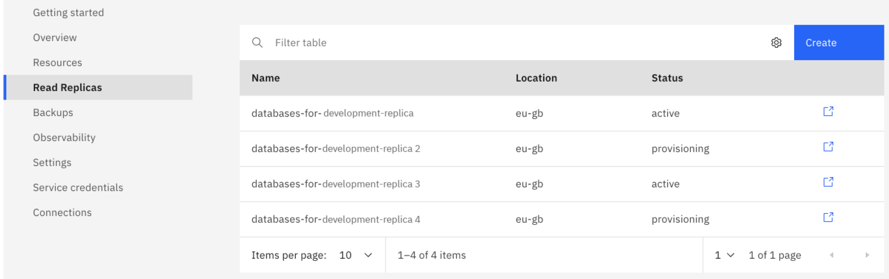

---

copyright:
  years: 2019, 2022
lastupdated: "2022-10-31"

keywords: postgresql, databases, read-only replica, resync, promote, cross-region replication, edb, enterprisedb

subcollection: databases-for-enterprisedb

---

{:external: .external target="_blank"}
{:shortdesc: .shortdesc}
{:screen: .screen}
{:codeblock: .codeblock}
{:pre: .pre}
{:tip: .tip}

# Configuring Read-only Replicas
{: #read-only-replicas}

You can set up your {{site.data.keyword.databases-for-enterprisedb_full}} deployment to be a read-only replica of another {{site.data.keyword.databases-for-enterprisedb}} deployment. 

A read-only replica is set up to replicate all of your data from the leader deployment to the replica deployment by using asynchronous replication. As the name implies, read-only replicas support read transactions, and can be used to balance databases that have both write-heavy and read-heavy operations. The read-only replica has a single {{site.data.keyword.databases-for-enterprisedb}} data member, and it is billed at the [same per member consumption rates as the leader](https://{DomainName}/catalog/services/databases-for-enterprisedb/).

## Read-only Replica Considerations
{: #read-only-replicas-consider}

- The read-only replica can exist in the same region as the source formation or in different one, enabling your data to be replicated across regions.

- A read-only replica must be the same major version as its leader. 

- Backups are unavailable on read-only replicas. Backups are taken only on leader deployments.

- Read replication is not supported into or out of EU Cloud-enabled regions (currently `eu-de`). It is supported within those regions.

- There is a limit of five read-only replicas per leader.

- The read-only replica does not participate in primary/follower elections for the leader cluster and failover to the read-only replica is not automated. Promotion of the read-only replica to a full deployment is a manual, user-initiated task.

- The minimum size of a read-only replica is 3 GB RAM and 60 GB of disk. This is true even if your leader deployment is smaller.

- Read-only replicas do not auto-scale to match the leader. If the amount of data you store outgrows the disk that is allocated to your deployments, scale the disk on the read-only replicas and then the leader. Scaling the read-only replica first ensures that you do not run out of space on the read-only replicas. If you scaled the leader's disk for performance and not for space, it is not necessary to scale the read-only replicas.

- Replication is asynchronous, and might be subject to replication lag. By default, there is no communication between the primary and replica regarding consistency. It is possible for a read-only replica to fall far enough behind that it needs to be resynced. Replication lag can be greater when the replica is in a region far away geographically from its leader.

- A read-only replica is a deployment with single data member and does not have any internal high-availability. It is prone to temporary interruptions and downtime during maintenance. If you have applications that rely on read-only replicas, be sure to have logic to retry failed queries, or load-balancing over multiple read-only replicas.

## The Leader
{: #read-only-replicas-leader}

On the _Read Replicas_ tab of a {{site.data.keyword.databases-for-enterprisedb}} deployment before any read-only replicas are provisioned, the center pane notes that no read replicas exist. Click **Create**.

{: caption="Figure 1. Replication pane before a replica" caption-side="bottom"}

If a deployment is a leader and has a read-only replica that is already attached to it, then the _Replication_ pane has a list of replica deployments and a link to each one. Click the cog to the right of the read-only replica's deployment name to manage it.

{: caption="Figure 2. List of replicas that are attached to a leader" caption-side="bottom"}

## Provisioning a Read-only Replica in the UI
{: #read-only-replicas-provision-ui}
{: ui}

You can provision a read-only replica from the leader's _Read Replicas_ tab by clicking **Create Read-Only Replica**. The source instance is automatically entered. The read-only replica's name is auto-generated in the _Service Name_ field, but you can rename it freely. You can choose the region to deploy it in, and its initial memory allocation. Disk size, version, and public or private endpoints are automatically configured to match the settings of the leader deployment.

If you use [Key Protect](/docs/databases-for-enterprisedb?topic=cloud-databases-key-protect), Bring Your Own Key (BYOK) is supported only when provisioning from the CLI and API. Otherwise, the read-only replica is encrypted with a generated key. 
{: .tip}

### Provisioning through the CLI
{: #read-only-replicas-cli}
{: cli}

Provisioning a read-only replica through the CLI and the API works similarly to [provisioning a standard {{site.data.keyword.databases-for-enterprisedb}} deployment](/docs/databases-for-enterprisedb?topic=cloud-databases-provisioning). Provisioning is handled by the Resource Controller, and it uses a parameter `{"remote_leader_id": "crn:v1:..."}` to specify the leader of the replica you are provisioning.

For example, to provision a read-only replica through the CLI,
```sh
ibmcloud resource service-instance-create <replica_name> databases-for-enterprisedb standard <region> \
-p \ '{
  "remote_leader_id": "crn:v1:bluemix:public:databases-for-enterprisedb:us-south:a/54e8ffe85dcedf470db5b5ee6ac4a8d8:1b8f53db-fc2d-4e24-8470-f82b15c71819::",
  "members_memory_allocation_mb": "3072",
  "members_disk_allocation_mb": "61440"
}'
```

You must specify both the RAM and disk amounts, keeping in mind the minimum size is 3 GB RAM and 60 GB disk. You can optionally specify whether the read-only replica uses public or private endpoints. You are not able to specify a version for the read-only replica. The version is automatically set to the same major version as the leader deployment.

### Provisioning through the API
{: #read-only-replicas-api}
{: api}

Provisioning a read-only replica through the CLI and the API works similarly to [provisioning a standard {{site.data.keyword.databases-for-enterprisedb}} deployment](/docs/databases-for-enterprisedb?topic=cloud-databases-provisioning). Provisioning is handled by the Resource Controller, and it uses a parameter `{"remote_leader_id": "crn:v1:..."}` to specify the leader of the replica you are provisioning.

For example, to provision a read-only replica through the the Resource Controller API.
```sh
curl -X POST \
  https://resource-controller.cloud.ibm.com/v2/resource_instances \
  -H 'Authorization: Bearer <>' \
  -H 'Content-Type: application/json' \
    -d '{
    "name": "<replica_name>",
    "target": "<region>",
    "resource_group": "<your_resource_group_id>",
    "resource_plan_id": "databases-for-enterprisedb-standard",
    "remote_leader_id": "crn:v1:bluemix:public:databases-for-enterprisedb:us-south:a/54e8ffe85dcedf470db5b5ee6ac4a8d8:1b8f53db-fc2d-4e24-8470-f82b15c71819::",
    "members_memory_allocation_mb": "3072",
    "members_disk_allocation_mb": "61440"
  }'
```

You must specify both the RAM and disk amounts, keeping in mind the minimum size is 3 GB RAM and 60 GB disk. You can optionally specify whether the read-only replica uses public or private endpoints. You are not able to specify a version for the read-only replica. The version is automatically set to the same major version as the leader deployment.

## The Read-only Replica
{: #read-only-replicas-tab}

On the _Read Replicas_ tab of a read-only replica, the _Replication_ pane contains its name and region, and the name and region of its leader. You can also resync the read-only replica and promote it.

{: caption="Figure 3. Replication pane of a read-only replica" caption-side="bottom"}

### Checking Replication Status
{: #check-repl-status}

Replication status is not automatically monitored, you must monitor replication.

You can check the replication status of a read-only replica with `psql`, but only from its leader. [Connect to the leader deployment with `psql`](/docs/databases-for-enterprisedb?topic=databases-for-enterprisedb-connecting-psql) by using the [admin credentials](/docs/databases-for-enterprisedb?topic=databases-for-enterprisedb-user-management#the-admin-user). Once you are connected run: `SELECT * from pg_stat_replication;`.

### Read-only Replica Users and Privileges
{: #read-only-replicas-users-priv}

- Any user on the leader, even ones present before read-only replica provision, can log in to and run reads on a read-only replica with the same privileges to objects that they have on the leader. 

- If you have more than one read-only replica that is attached to a leader, a user that is created on the leader is also created on all of the other read-only replicas.

- Users that are created on the leader persist on the read-only replica when it is promoted to a stand-alone deployment, including the `admin` user. When the read-only replica is promoted the users and privileges for all users on the leader are transferred to the promoted deployment.

- Write operations on the read-only replica for all users are not filtered or rejected, but fail at the database level.

You can also create users with access to the read-only replica and no access to the leader from the read-only replica. If you have more than one read-only replica that is attached to a leader, a user that is created on any one of the read-only replicas is also created on all of the other read-only replicas.

Read-only replica users who are created on a read-only replica are able connect to the replicas and run reads. Read-only replica users are not able to connect and run operations on the leader. They also do not persist when a read-only replica is promoted to a stand-alone deployment.

Read-only replica created users are assigned privileges by the leader, and are assigned the `ibm-cloud-base-user-ro` role, and are members of the `ibm-cloud-base-user` group. They have access to all of the objects that are created by other members of this group, including any users on the leader that were created through _Service Credentials_, the CLI, or the API. Consistent with privileges of the `ibm-cloud-base-user`, a read-only replica created user does not have access to objects created by the admin user, or other users created through `psql`. For more information, see the [{{site.data.keyword.databases-for-enterprisedb}} Roles and Privileges](/docs/databases-for-enterprisedb?topic=databases-for-enterprisedb-user-management) page.

## Resyncing a Read-only Replica in the UI
{: #read-only-replicas-resync-ui}
{: ui}

If you need to resync a read-only replica, click **Resync Read-Only Replica**. Resyncing is a disruptive operation and performing a resync tears down and rebuilds the data in the read-only replica. The read-only replica is not able to perform any other operations or run any queries while a resync is running. Queries are not rerouted to the leader, so any connections to the read-only replica fail until it is finished resyncing. 

The amount of time it takes to resync a read-only replica varies, but the process can be long running.
{: .tip}

## Resyncing a Read-only Replica through the CLI
{: #read-only-replicas-resync-cli}
{: cli}

To start a resync through the CLI, use the [`cdb read-replica-resync`](/docs/databases-cli-plugin?topic=databases-cli-plugin-cdb-reference#read-replica-resync) command.
```sh
ibmcloud cdb read-replica-resync <deployment name>
```

The amount of time it takes to resync a read-only replica varies, but the process can be long running.
{: .tip}

## Resyncing a Read-only Replica through the API
{: #read-only-replicas-resync-api}
{: api}

To start a resync through the API, send a POST to the [`/deployments/{id}/remotes/resync`](https://cloud.ibm.com/apidocs/cloud-databases-api#resync-read-only-replica) endpoint.
```sh
curl -X POST \
  https://api.{region}.databases.cloud.ibm.com/v4/ibm/deployments/{id}/remotes/resync \
  -H 'Authorization: Bearer <>' 
```

The amount of time it takes to resync a read-only replica varies, but the process can be long running.
{: .tip}

## Promoting a Read-only Replica in the UI
{: #read-only-replicas-promoting}
{: ui}

A read-only replica is able to be promoted to an independent cluster that can accept write operations and read operations. If something happens to the leader deployment, the read-only replica can be promoted to a stand-alone cluster and start accepting writes from your application. 

To promote a read-only replica from the UI, click **Promote Read-Only Replica**.

Upon promotion, the read-only replica terminates its connection to the leader and becomes a stand-alone {{site.data.keyword.databases-for-enterprisedb}} deployment. The deployment can start accepting and running read and write operations, backups are enabled, and it is issued its own admin user. A new data member is added so the deployment becomes a cluster with two data members. This increases the cost as it is billed at the same per member consumption rate, but the deployment has two members instead of one.

When you promote a read-only replica, you can skip the initial backup that would normally be taken upon promotion. Skipping the initial backup means that your replica becomes available more quickly, but no immediate backup is available. You can start an on-demand backup after the promotion process is complete.

After a read-only replica is promoted to an independent deployment, it is not possible to revert it back to a read-only replica or have it rejoin a leader.


## Promoting a Read-only Replica through the CLI
{: #read-only-replicas-promoting-cli}
{: cli}

To promote through the CLI, use the [`cdb read-replica-promote`](/docs/databases-cli-plugin?topic=databases-cli-plugin-cdb-reference#read-replica-promote) command.
```sh
ibmcloud cdb read-replica-promote <deployment name>
```

Upon promotion, the read-only replica terminates its connection to the leader and becomes a stand-alone {{site.data.keyword.databases-for-enterprisedb}} deployment. The deployment can start accepting and running read and write operations, backups are enabled, and it is issued its own admin user. A new data member is added so the deployment becomes a cluster with two data members. This increases the cost as it is billed at the same per member consumption rate, but the deployment has two members instead of one.

When you promote a read-only replica, you can skip the initial backup that would normally be taken upon promotion. Skipping the initial backup means that your replica becomes available more quickly, but no immediate backup is available. You can start an on-demand backup after the promotion process is complete.

After a read-only replica is promoted to an independent deployment, it is not possible to revert it back to a read-only replica or have it rejoin a leader.

## Promoting a Read-only Replica through the API
{: #read-only-replicas-promoting-api}
{: api}

To promote through the API, send a POST to the [`/deployments/{id}/remotes/promotion`](https://cloud.ibm.com/apidocs/cloud-databases-api#modify-read-only-replication-on-a-deployment) endpoint.
```sh
curl -X POST \
  https://api.{region}.databases.cloud.ibm.com/v4/ibm/deployments/{id}/remotes/promotion \
  -H 'Authorization: Bearer <>'  \
 -H 'Content-Type: application/json' \
 -d '{"promotion": {}}' \ 
```

To promote and skip the initial backup after the promotion, also set `skip_initial_backup` in the JSON body.
```sh
curl -X POST \
  https://api.{region}.databases.cloud.ibm.com/v4/ibm/deployments/{id}/remotes/promotion \
  -H 'Authorization: Bearer <>'  \
 -H 'Content-Type: application/json' \
 -d '{"promotion": {"skip_initial_backup": true}}' \ 
 ```

Upon promotion, the read-only replica terminates its connection to the leader and becomes a stand-alone {{site.data.keyword.databases-for-enterprisedb}} deployment. The deployment can start accepting and running read and write operations, backups are enabled, and it is issued its own admin user. A new data member is added so the deployment becomes a cluster with two data members. This increases the cost as it is billed at the same per member consumption rate, but the deployment has two members instead of one.

When you promote a read-only replica, you can skip the initial backup that would normally be taken upon promotion. Skipping the initial backup means that your replica becomes available more quickly, but no immediate backup is available. You can start an on-demand backup after the promotion process is complete.

After a read-only replica is promoted to an independent deployment, it is not possible to revert it back to a read-only replica or have it rejoin a leader.
